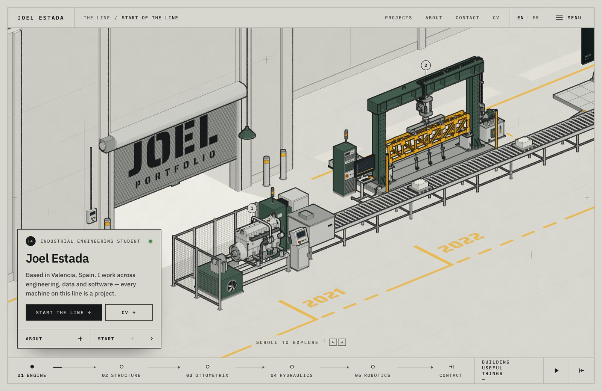
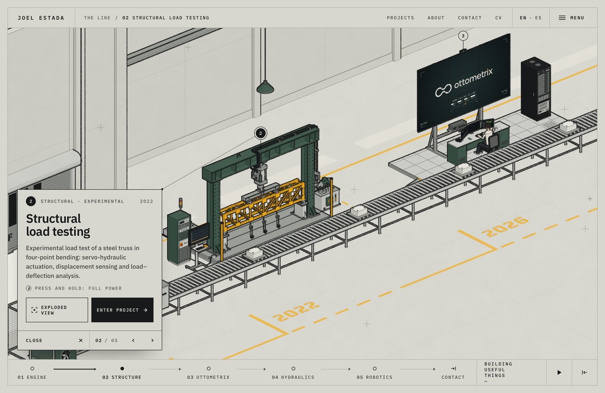
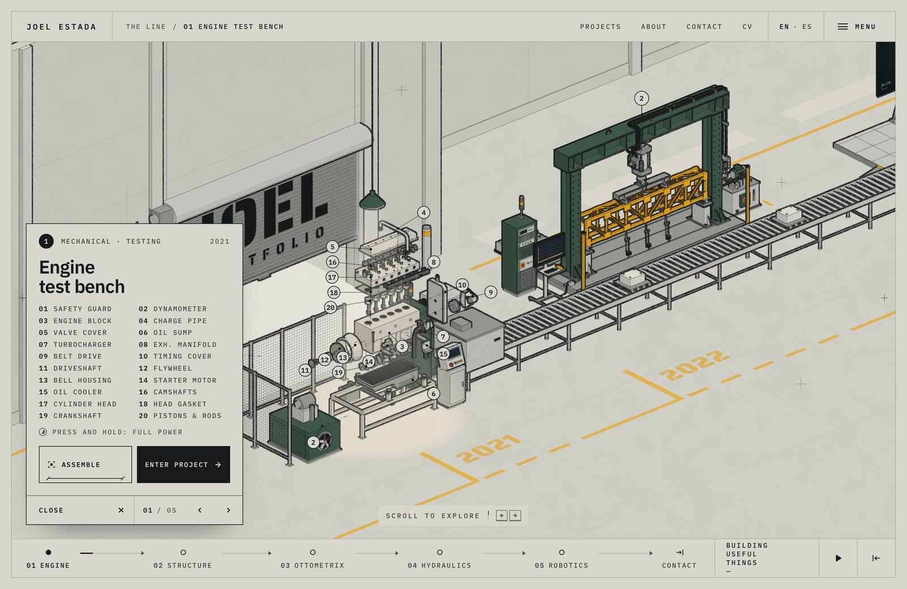
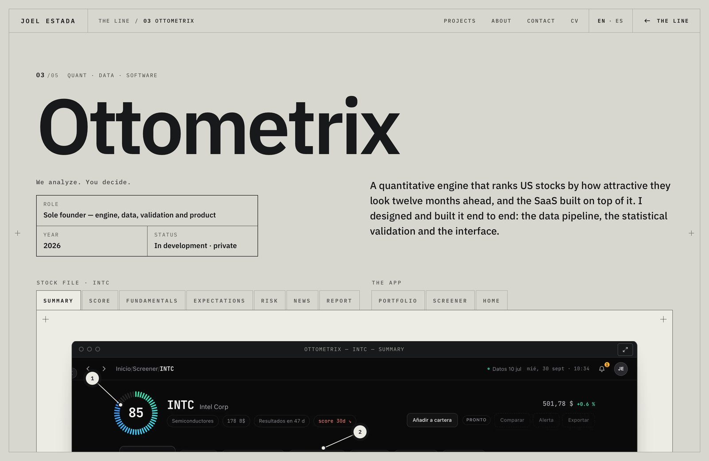
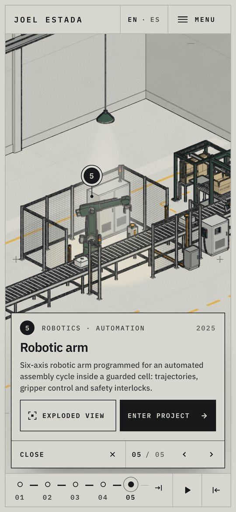

# Joel Estada — Portfolio

**An isometric factory where every machine is a project.**
Scroll along a production line drawn like an engineering sheet: each station is something I built, studied or tested,
and the line ends at the way out — the contact.



**Live:** [joelestada.com](https://joelestada.com) · **Languages:** English · Español

## What's inside

|                                                                |                                                                      |
| -------------------------------------------------------------- | -------------------------------------------------------------------- |
|              |              |
| Each machine has a card: what it is, the year, the discipline. | Exploded views take every machine apart, with a numbered parts list. |
|                     |       |
| Project sheets tell the full story (here, Ottometrix).         | On a phone the line is swiped sideways.                              |

- **Five working stations** — an engine on a dynamometer, a structural load test, the Ottometrix control room, a
  hydraulic energy-recovery press and a robotic cell — plus a packer that boxes every part before it leaves through the door.
  Parts travel on the conveyor and each machine works on the one in front of it. Press and hold a machine to run it at full power.
- **Bilingual by hand** — `/en` and `/es`, every text written in both languages side by side; the visitor's language is
  picked from a cookie or the browser.
- **Works without 3D** — if WebGL is not available, the line turns into a scrollable set of drawings with the same content.
- **Printable CV** — a single A4 sheet, ready to save as PDF.
- **Accessible** — full keyboard control (arrows, space, Home/End, P to pause, M for the menu, Esc), reduced-motion support,
  and an automated check for text size and contrast.

## How it is drawn

The scene is plain three.js geometry (no models are loaded) rendered through a custom pipeline that makes it look like
an ink drawing on paper:

1. **Colour** — three-tone toon shading with a fixed light, flat decals for floor paint and lettering.
2. **Normals and part IDs** — a second pass with an override material.
3. **Ink mask** — silhouettes from the Laplacian of linear depth (exact zero on flat surfaces in an orthographic view),
   interior edges from sharp normal creases and part-ID changes; silhouettes in full ink, interior edges lighter.
4. **Light** — hanging lamps light the station under the cursor, with an analytic volumetric beam at half resolution.
5. **Composite** — slightly misregistered colour, paper grain, light and ink.

### Performance

A full-screen drawing like this is expensive, so the renderer avoids repainting what has not changed:

- **Shifted frames.** The camera moves in whole pixels; while scrolling, the previous frame is copied shifted and only the
  strip that enters, plus the regions that animate, are drawn again.
- **Exact dirty regions.** Every animation declares the world-space box it changes; a verification script compares partial
  frames with full repaints and must find 0 different pixels.
- **Per-part culling and merged meshes** inside those regions, which halves the draw calls.
- **Frame clock.** Everything moves by whole display refreshes instead of `performance.now()`, which Safari rounds to 1 ms
  and which made motion stutter.
- **Lean bundle.** `three` is aliased to a module that re-exports only what the scene uses.

On a MacBook Air M3 (1470×956 @2x, Safari) the GPU takes about 4 ms per frame (p99 6 ms).

## Stack

[Next.js 16](https://nextjs.org) (App Router) · [React 19](https://react.dev) ·
[React Three Fiber](https://r3f.docs.pmnd.rs) · [three.js](https://threejs.org) · [Lenis](https://lenis.darkroom.engineering) ·
TypeScript · IBM Plex Sans and Mono · Playwright for the checks and captures.

## Project structure

```
src/
├── app/[lang]/        Pages per language: the line, project sheets, CV and 404
├── config/            Content and layout: stations, projects, CV, parts, palette, dimensions
├── i18n/              Language routing helpers and the interface texts (en / es)
├── lib/               Runtime state shared by the scene and the interface
├── scene/             The 3D factory
│   ├── effects/       Ink pass, shaders, paper and light
│   ├── stations/      One component per machine (with its parts in a folder)
│   ├── line/          Plant clock, conveyor, parts on the line, cartons and tape
│   ├── building/      Walls, floor, floor paint, shutter and exit door
│   ├── life/          People, the AGV and the wall crane
│   └── kit/           Reusable pieces: primitives, hardware, fences, lamps, cabinets
├── ui/                HTML interface over the scene: bar, card, panel, rail, sheets
└── proxy.ts           Sends every address without a language to /en or /es
scripts/               Checks, measurements, captures and generated images (Playwright)
public/                Fonts, project images, machine plates and share images
```

## Running it

```bash
npm install
npm run dev          # http://localhost:3000
npm run check        # types, lint, formatting and type scale
npm run build && npm run start
```

| Command                                             | What it does                                                     |
| --------------------------------------------------- | ---------------------------------------------------------------- |
| `check:repaint`                                     | Partial repaints must match full repaints pixel for pixel        |
| `check:a11y`                                        | Text size, contrast, headings, names and tab order               |
| `measure:perf` / `measure:load`                     | GPU time per frame / load time on a throttled phone (production) |
| `shots`, `shots:ui`, `shots:hover`, `shots:station` | Screenshots of the line, the interface and each machine          |
| `gen:plates` / `gen:og`                             | Regenerate the machine plates and the share images               |

The checks and captures expect the dev server to be running.

## License

© 2026 Joel Estada. All rights reserved.
